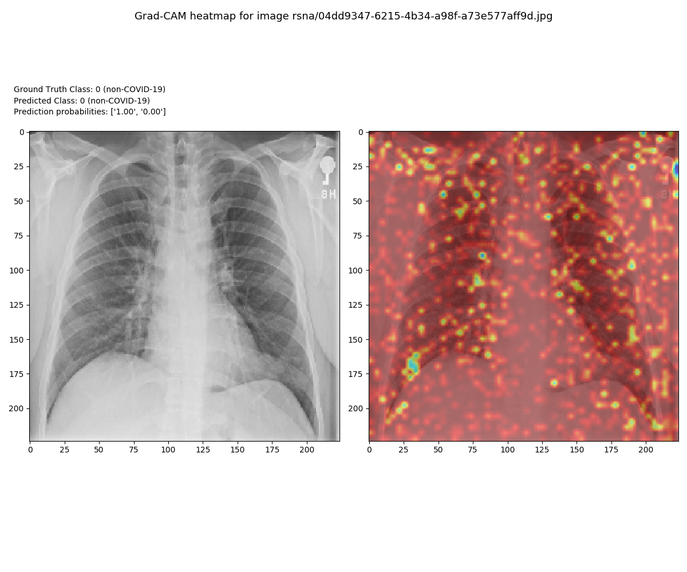
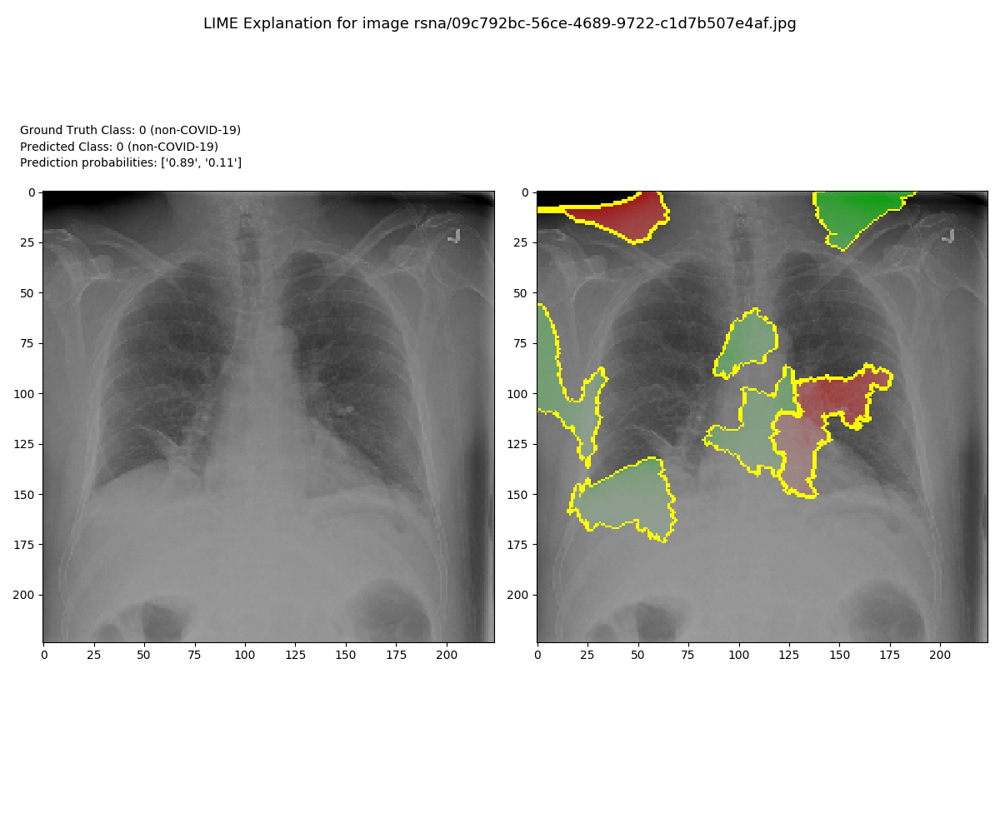
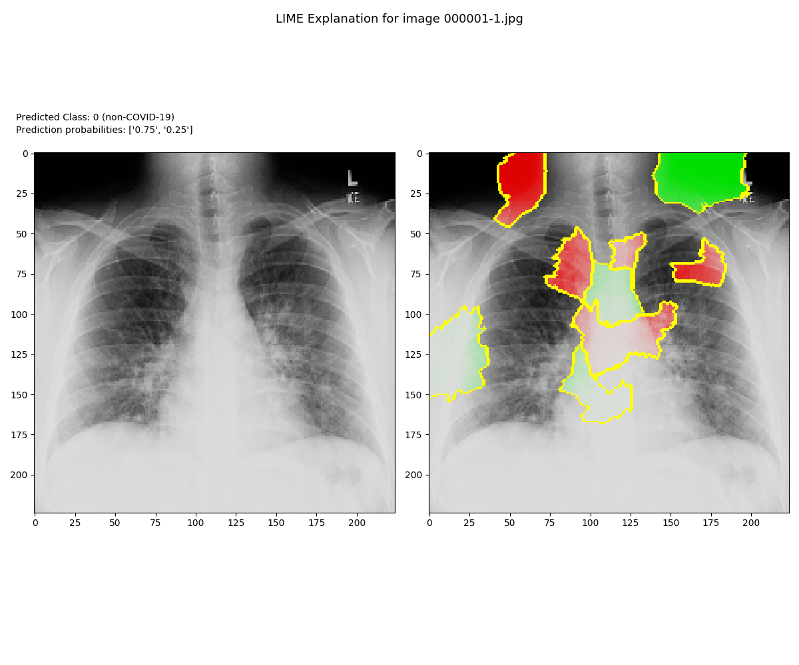
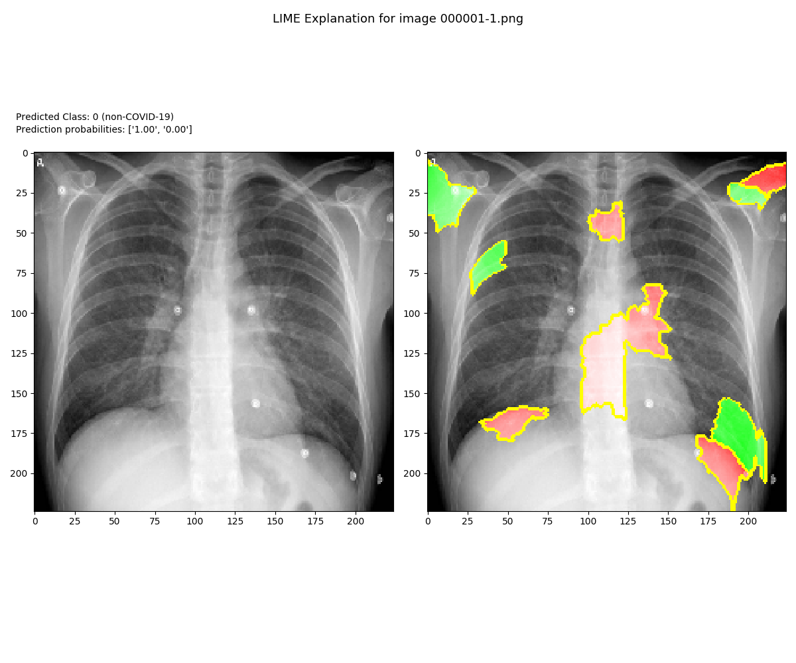
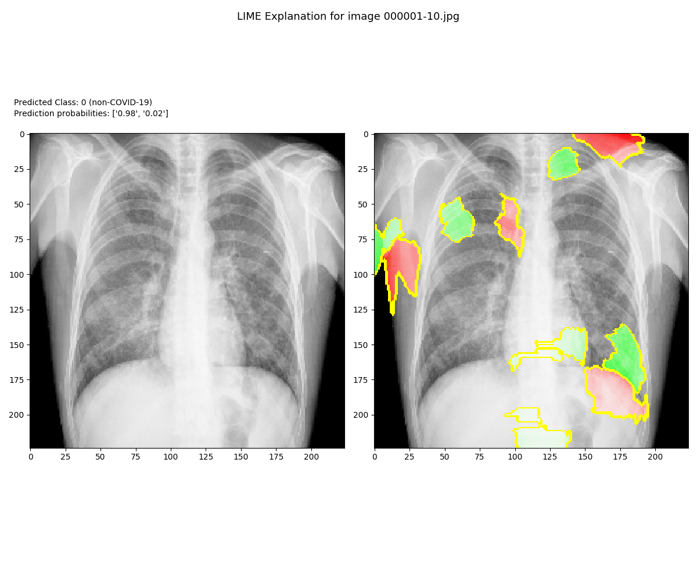

# CS 677

## Project 2

Sean Walsh (ucid:sw522)

Jonathan Vidal (ucid: jkv5)

Nayem Paiker (ucid: nrp66)

### Important Steps

Download the covid-cxr repo
https://github.com/aildnont/covid-cxr

Download the 3 image repos

[covid-chestxray-dataset](https://github.com/ieee8023/covid-chestxray-dataset)

[Figure1-COVID-chestxray-dataset](https://github.com/agchung/Figure1-COVID-chestxray-dataset)

[RSNA Pneumonia Detection Challenge](https://www.kaggle.com/c/rsna-pneumonia-detection-challenge)

Update your config.yml file to point to these repos

Execute src/data/preprocess.py to create Pandas
DataFrames of filenames and labels. Preprocessed DataFrames and
corresponding images of the dataset will be saved within
_data/preprocessed/_.

Execute src/train.py to train the neural network model.
The trained model weights will be saved within _results/models/_, and
its filename will resemble the following structure:
modelyyyymmdd-hhmmss.h5, where yyyymmdd-hhmmss is the current time.
The [TensorBoard](https://www.tensorflow.org/tensorboard) log files
will be saved within _results/logs/training/_.
   
Once again edit the yml file to direct the code to the location of model 
the model you just generated with the training process

Execute src/interpretability/lime_explain.py to generate
interpretable explanations for the model's predictions on the test
set. 

### GradCam Explanation

### LIME Explanation

### Prediciton Samples

### SHAP

[Original_SHAP_Repo](https://github.com/slundberg/shap)

We have provided the models.py and config.yml files from the covis-cxr repo to create the model
shell and the shap_final file that runs the SHAP explanation.  The image and model path has
been hard coded into the shap_final.py script.  I have not included the h5 model file due to its
size but it is using the resnet50v2 so if you have your own h5 file of that type the weights
can be loadede from that.

The sample x-ray that was used is included as well as the output image.

Shap output image and explanation is included in our group paper on SHAP.

